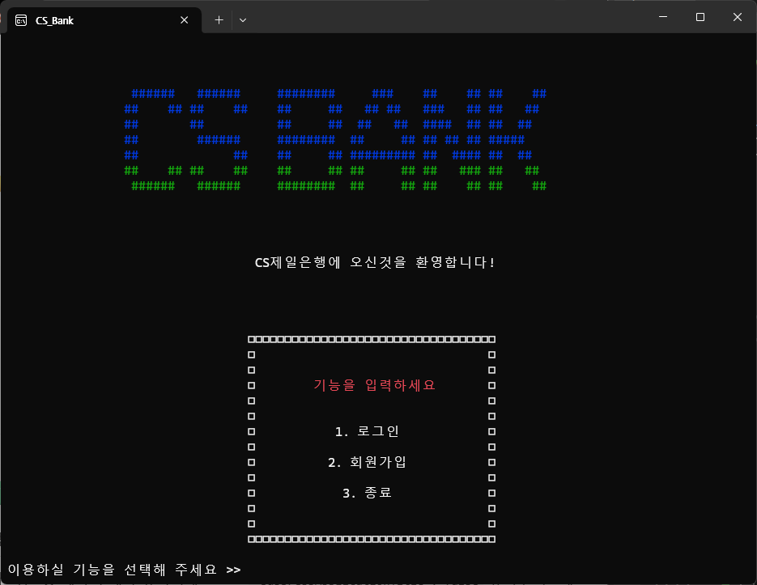
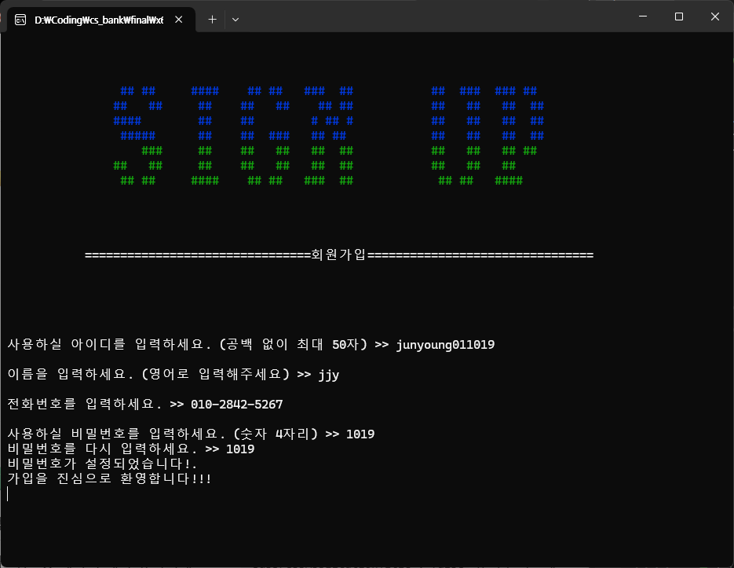
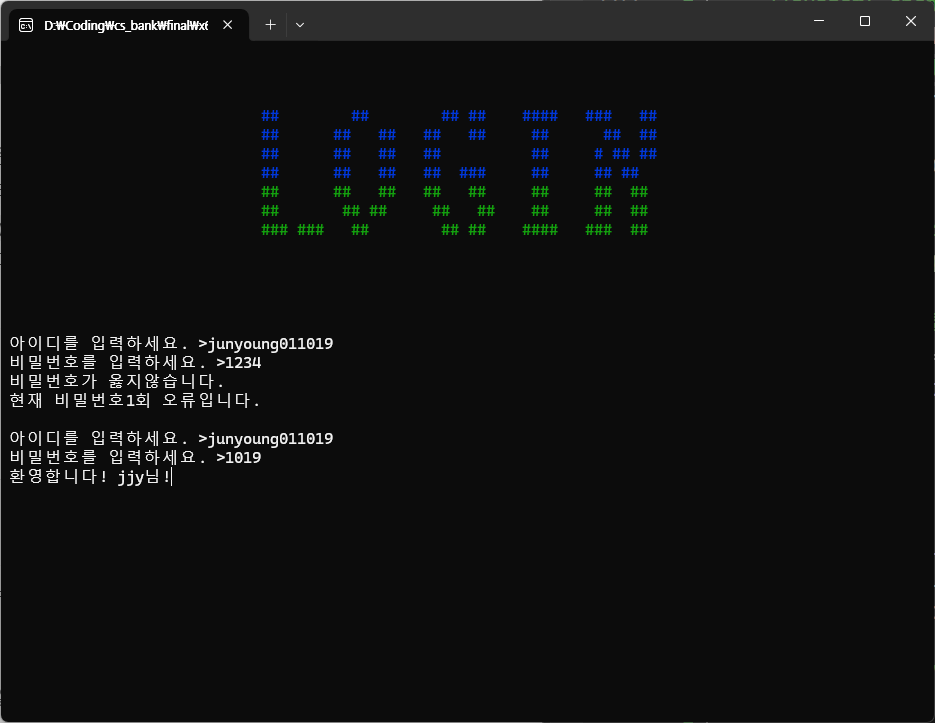
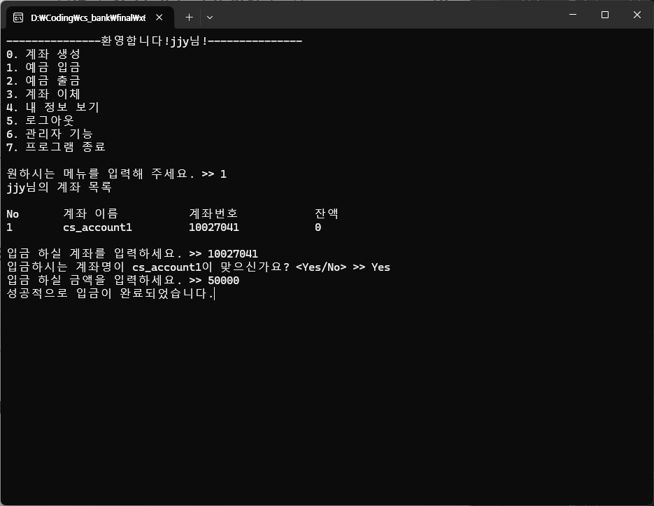
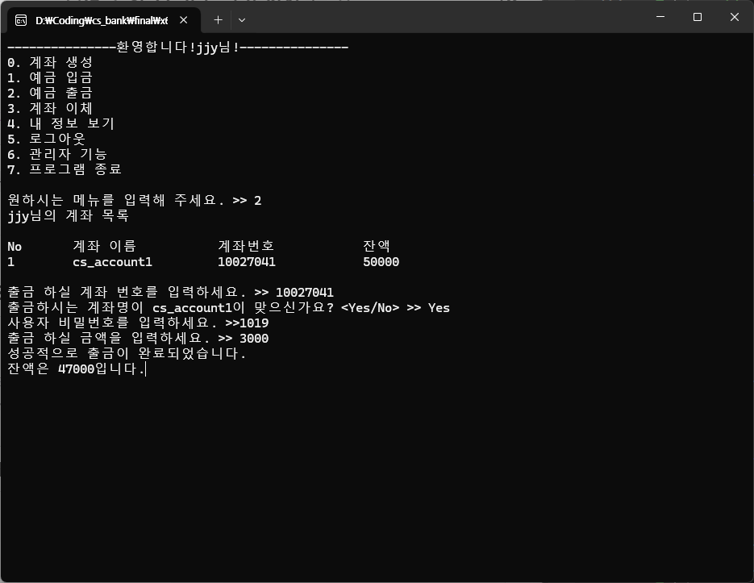

# [C++ 기반 MySQL 연동] CS 제일은행


<br>

## 🌟 프로젝트 소개

- CS제일은행은 C++로 개발된 객체지향 기반의 모의 은행 시스템입니다.
- 회원 정보 및 계좌 정보는 MySQL 데이터베이스에 저장하였습니다.
- C++ 전용 MySQL 라이브러리를 통해 DB와 연동을 구현하였습니다.

<br>

## 목차

1. [개발 환경](#1-%EF%B8%8F-개발-환경)
2. [사용 기술 스택](#2-사용-기술-스택)
3. [프로젝트 구조](#3-%EF%B8%8F-프로젝트-구조)
4. [개발 기간 및 작업 관리](#4-개발-기간-및-작업-관리)
5. [개발 중점 사항](#5-개발-중점-사항)
6. [기능 시연](#6-%EF%B8%8F기능-시연)
7. [추후 고려 사항](#7--추후-고려-사항)
8. [프로젝트 회고](#8--프로젝트-회고)

<br>

## 1. 🛠️ 개발 환경

- IDE: Visual Studio Community 2022
- 개발 언어: C++
- 데이터베이스: MySQL 8.0.34
- 버전 관리: [GitHub - CS 제일은행](https://github.com/junyoung011019/cpp-csbank-system), GitHub Desktop
- 협업 도구: Discord
- 최소 실행 환경:
    - CPU: Intel Pentium 4 1GHz 이상
    - RAM: 512MB 이상
    - 저장 공간: HDD 300MB 이상

<br>

## 2. 🔌 사용 기술 스택

### C++ (OOP)

- 캡슐화 (Encapsulation)
    - 고객 정보(이름, 주소, 전화번호, 비밀번호)와 잔액 등은 private으로 선언하여 외부 접근을 차단
    - public 메서드를 통해서만 데이터를 읽거나 수정할 수 있도록 설계

- 상속 (Inheritance)
    - Transaction(계좌/거래) 클래스를 CustomerInfo(고객 클래스)가 상속받아
    “계좌를 소유하고 거래할 수 있는 사용자” 개념을 표현

- 추상화 (Abstraction)
    - 사용자는 입출금 처리 방식 등의 내부 구현을 몰라도
    deposit(), withdraw() 메서드를 호출하면 바로 기능을 사용할 수 있음

- 기타 설계 요소
    - 거래 로직과 고객 정보를 각각 별도의 클래스로 분리해 책임을 명확히 분리
    - isLogin 플래그를 사용하여 회원가입 여부 및 사용자 상태 관리 구현

### MySQL

- 데이터의 영속적 저장
    - 단순 변수 사용 시 프로그램 종료 시 데이터가 사라지는 문제를 해결
    - 초기에는 파일 저장(txt)을 고려했지만, 수업 중 학습한 DB 이론을 직접 실습해보기로 결정
    - C++ 전용 MySQL 라이브러리 사용을 통해 처음으로 외부 DB 연동 경험

- DB 설계
    - 회원 테이블과 계좌 테이블을 설계하여 구조화된 데이터 관리
    - 회원의 고유한 ID를 **기본키(Primary Key)** 로 설정하여 식별 및 관계 구성

<br>

## 3. 🗂️ 프로젝트 구조

```
├── README.md
├── final
│   └── main.cpp -> 실제 작성 코드
│   └── libmysql.dll -> DB 연동 파일
│   └── final.sln
│
└── asset
    └── 리드미에 사용되는 이미지
```

<br>

## 4. 📆 개발 기간 및 작업 관리

### 개발 기간

- 전체 개발 기간 : 2023-09-03 ~ 2022-12-2
- DB 구성 및 연동 코드 설계 : 2023-09-15 ~ 2022-11-10
- 전체 기능 구현 : 2023-09-03 ~ 2023-11-25
- 최종 발표 : 2023-11-29

<br>

### 회의와 버전 및 형상 관리

- **GitHub**를 활용하여 소스 코드의 버전 관리를 체계적으로 수행하였습니다.
- **Google Drive**를 통해 개발 산출물(기획서, 설계서 등)에 대한 형상 관리도 병행하였습니다.
- **매주 정기 회의**를 통해 개발 진행 상황을 공유하고, 기술적 어려움이나 이슈를 함께 논의하였습니다.
- **비대면 상황에서는 Discord를 활용**하여 원활한 커뮤니케이션을 유지하였습니다.
- 회의가 끝난 후에는 **회의록**을 작성하여 주차별 목표 및 논의 내용을 문서화하였습니다.

<br>

## 5. 🎯 개발 중점 사항

- 최대한 객체지향 특성이 잘 드러나도록 설계
- DB 연동을 최우선 목표로 설정하여 교과목 간 연계 실현
- 지속적인 산출물 관리를 통해 프로젝트 진행 정리

<br>

## 6. ▶️ 기능 시연

<table>
  <tr>
    <td align="center">
      <br>
      <sub>메인화면</sub>
    </td>
    <td align="center">
      <br>
      <sub>회원가입</sub>
    </td>
  </tr>
  <tr>
    <td align="center">
      <br>
      <sub>로그인</sub>
    </td>
    <td align="center">
      <br>
      <sub>계좌 개설</sub>
    </td>
  </tr>
  <tr>
    <td align="center">
      <br>
      <sub>입금</sub>
    </td>
    <td align="center">
      <br>
      <sub>출금</sub>
    </td>
  </tr>
  <tr>
    <td align="center">
      <br>
      <sub>계좌 이체</sub>
    </td>
    <td align="center">
      <br>
      <sub>정보 조회</sub>
    </td>
  </tr>
</table>


<br>

## 7. 📌 추후 고려 사항

- 추가 구현해보고 싶은 사항
    - 다양한 상품(정기 예금, 적금)등 추가
    - 다른 은행과의 연동(계좌 및 송금)
    - 콘솔창에서 벗어나 GUI 형식 프로그램 제작
    - 장애인 및 노약자를 위한 접근성 기능 추가

- 보안적인 측면
    - SQL 인젝션 공격 방어
    - 비밀번호 해싱 후 DB 저장
    - 키보드 입력 내용 *표시로 암호화

<br>

## 8. 🤔 프로젝트 회고

- OOP와 교과목간 연계

 단순히 하나의 프로그램을 개발하는 것을 넘어, 객체지향 프로그래밍(OOP) 특성을 살려 C++ 코드를 구조적으로 설계해볼 수 있었던 점이 인상 깊었다.

 또한, 데이터베이스(DB) 과목과 연계하여 MySQL을 직접 연동해보는 과정은 실습적인 이해를 높이는 데 큰 도움이 되었다.

- 프로젝트 후 보람

 외부 라이브러리를 처음 연동하다 보니 버전 이슈나 연결 오류 등 다양한 문제가 발생했지만, 반복적인 시도 끝에 성공적으로 연동할 수 있었고, 그 과정에서 큰 보람을 느꼈다.

- 협업 간 어려웠던점

첫 협업 프로젝트였기에 GitHub 사용도 처음이었는데, 코드 공유 측면에서는 유용했지만 충돌 해결은 다소 어려움이 있었다.

또한, 각자의 개발 환경에 MySQL을 설치해 사용하는 방식이 번거로웠고, 다음에는 더 효율적인 환경 설정 방법을 고민해볼 필요가 있다고 느꼈다.
